# En resa genom maskinlärningens historia – När behöver vi egentligen mer avancerad AI?

AI-utvecklingen beskrivs ofta som en rad stora språng. Men hur stora är de egentligen när man försöker mäta dem på samma villkor?

Inspirerad av [Ed Donners](https://github.com/ed-donner/llm_engineering/tree/main/week6) projekt ville jag göra en resa genom maskininlärningens utveckling och se vad varje nytt steg faktiskt tillför. Därför ställde jag **modeller från olika generationer mot exakt samma problem**, med samma data och samma måttstock – från enkel linjär regression och egna neurala nät till toppmoderna språkmodeller och slutligen skräddarsydd fine-tuning.

Själva testet var medvetet enkelt: kan en modell förutsäga priset på olika Amazon-produkter utifrån enbart dess beskrivning?

Priserna är egentligen inte poängen. De fungerar snarare som en gemensam måttstock – ett sätt att göra flera decenniers utveckling inom maskininlärning direkt jämförbar i ett och samma experiment.

**Måttstock:** Genomsnittligt absolut prisfel (MAE, Mean Absolute Error) i dollar. Lägre är bättre.

**Notering:** Resultaten gäller det här experimentet. Den mänskliga referensen omfattar 100 produkter; Deep NN-diagrammet visar en separat körning på ett mindre dataset. Kodblocken är utdrag ur projektets notebooks och förutsätter deras importer, data och övriga förberedelser.

## Innehåll

- [Rond 1 – mänsklig referens och enkla modeller](#rond-1) 
- [Rond 2 – Bag-of-Words](#rond-2)
- [Rond 3 – Random Forest och XGBoost](#rond-3)
- [Rond 4 – neurala nät och språkmodeller](#rond-4)
- [Rond 5 – fine-tuning](#rond-5)
- [Grundarbetet – dataurval och kontextdesign](#grundarbetet)
- [Samlad resultattavla](#resultat)
- [Mina lärdomar](#lardomar)
- [Slutsats – vad resan säger om AI](#slutsats)
- [Kod och originalnotebooks](#notebooks)

---


## Rond 1: En mänsklig referens och de första stapplande stegen

Innan algoritmerna släpptes lösa behövdes en mänsklig referens. Hur bra är en människa på den här uppgiften?

Ed Donner gjorde en miniversion av detta test där han läste produktbeskrivningarna för 100 slumpmässigt utvalda Amazon-produkter och skrev ner sina gissningar. Facit visade då att han i genomsnitt gissade fel med **87,62 dollar per produkt**.

- **Resultat (Människa):** I genomsnitt **87,62 dollar** felgissat.

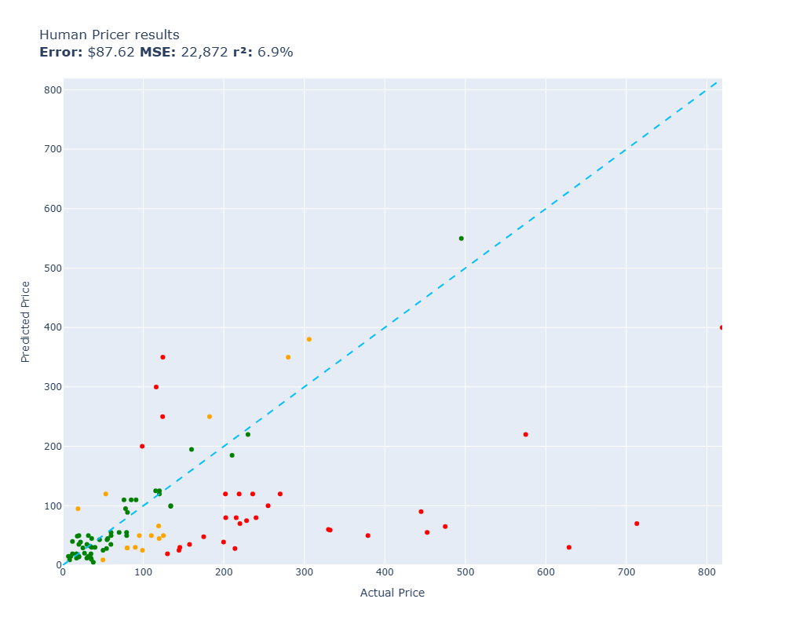

*Varje punkt i diagrammet representerar en produkt. Den vågräta axeln visar det verkliga priset och den lodräta visar gissningen. Den streckade diagonalen är en perfekt träff – ju längre bort från linjen en punkt hamnar, desto större är felet.*

Detta är vår mänskliga ribba i testet. Låt oss se hur de första matematiska modellerna klarar sig.

### Första jämförelsen: gissa alltid på medelpriset

Den enklast tänkbara lösningen är en modell som är helt blind. Den struntar helt och hållet i produktbeskrivningen och gissar konsekvent på medelpriset för alla produkter i träningsdatan (140,57 dollar).

- **Resultat (Gissa medelpris):** Ett genomsnittligt fel på **106,18 dollar**.

Om den mänskliga gissningen ($87,62) är riktmärket så är detta den absoluta lägstanivån. Varje modell som byggs efter detta måste prestera betydligt bättre än så för att ha något existensberättigande.

### Linjär regression med dålig information

Går det att förbättra gissningen genom att använda en linjär regressionsmodell och ge den två ganska simpla egenskaper: produktens vikt och antalet tecken i den sammanfattade beskrivningen?

- **Resultat (Enkel regression):** Ett genomsnittligt fel på **101,56 dollar**.

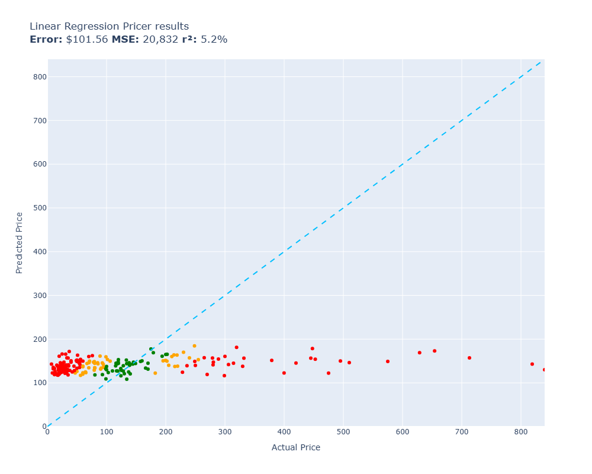

*Med endast vikt och beskrivningens längd som indata kan den linjära regressionen i princip bara lägga en helt platt linje strax under medelvärdet.*

Resultatet blev knappt en mätbar förbättring. Men det är inte den linjära regressionens fel – det är vi som gav den dåliga förutsättningar. Vikten på ett paket avslöjar sällan om det innehåller billig plast eller dyr elektronik. Inte heller beskrivningens längd har något som helst samband med priset, vilket visas av spridningsdiagrammet nedan:

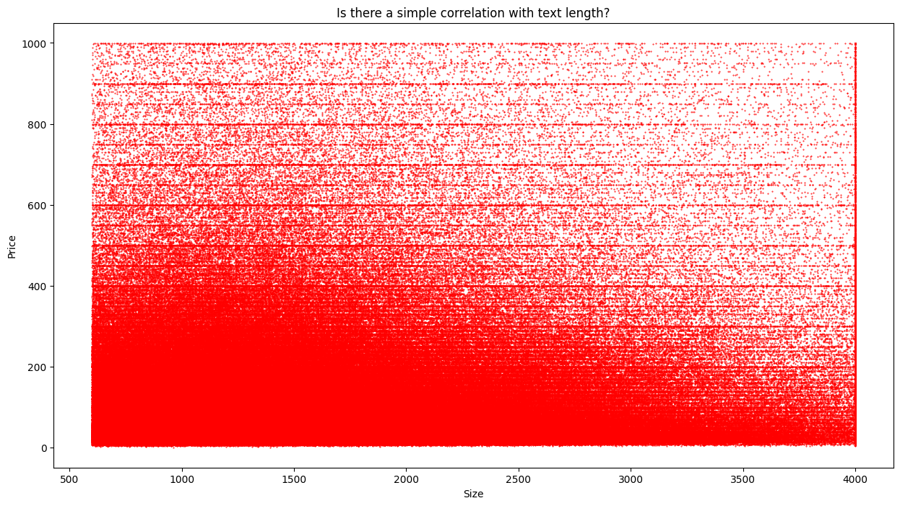

*Det finns inget enkelt mönster mellan hur mycket en tillverkare skriver och vad produkten kostar. För att lyckas bättre måste modellerna på något sätt få tillgång till innehållet och förså orden i texten.*

<details>
<summary><strong>Visa teknisk fördjupning: Så blir produktens egenskaper en prisgissning</strong></summary>

Först plockas de två huvudsakliga egenskaperna ut: produktens vikt och längden på dess sammanfattning. En extra markering anger om vikten saknas:

```python
def get_features(item):
    return {
        "weight": item.weight,
        "weight_unknown": 1 if item.weight == 0 else 0,
        "text_length": len(item.summary)
    }
```

`weight_unknown` blir 1 när vikten är okänd och annars 0. Det gör att en saknad vikt kan behandlas separat från en uppmätt vikt.

Egenskaperna samlas i tabellen `train_df` tillsammans med produktens pris. Sedan tränas modellen:

```python
feature_columns = ['weight', 'weight_unknown', 'text_length']

X_train = train_df[feature_columns]
y_train = train_df['price']

# Train a Linear Regression
model = LinearRegression()
model.fit(X_train, y_train)
```

Modellen lär sig hur mycket varje egenskap ska påverka prisgissningen. Men den får fortfarande ingen information om vad produkten faktiskt är. Den kan justera sin gissning efter vikt och textlängd, men saknar de ledtrådar som skiljer exempelvis ett enkelt tillbehör från en avancerad apparat.

Fullständigt sammanhang: [Steg 3 – klassisk maskininlärning](notebooks/steg3.html).
</details>
---


## Det viktiga grundarbetet: Att arbeta med tre miljoner produktbeskrivningar

Innan vi går djupare in på testerna behöver vi titta på det nödvändiga grundarbetet. Maskininlärning bygger helt på principen **skräp in ger skräp ut** – och rå Amazon-data är extremt stökig.

Vi laddade ner ett gigantiskt dataset från Hugging Face med beskrivningar av cirka 3 miljoner produkter. Vid en manuell granskning hittades till exempel en mikrovågsugn för **21 000 dollar**. Det visade sig vara en professionell TurboChef-ugn avsedd för restaurangkök. Även om priset var korrekt, är det en outlier som skulle förvirra våra modeller. Prisspannet avgränsades därför till mer normala konsumentnivåer: **0,50 till 999,49 dollar**.

### Ett viktat urval: Vilka produkter ska modellen få lära sig av?

Att rensa bort fel och dubbletter var bara en del av arbetet. Vi behövde också välja vilka **820 000 produkter** som skulle ingå i experimentet. Om billiga produkter och några stora kategorier dominerar materialet får modellerna mindre möjlighet att lära sig resten av variationen.

Därför gjorde vi ett **viktat slumpmässigt urval**. Dyrare produkter fick större chans att komma med, medan de dominerande kategorierna Automotive och Tools and Home Improvement fick lägre urvalsvikt. Syftet var att ge modellerna ett bredare material att lära sig av.

**Visa teknisk fördjupning: Så styrdes urvalet av produkter**

Priserna omvandlas först till värden mellan 0 och 1. Dessa används sedan för att ge varje produkt en urvalsvikt:

```python
np.random.seed(42)

SIZE = 820_000

prices = np.array([it.price for it in items], dtype=float)
categories = np.array([it.category for it in items])
p = (prices - prices.min()) / (prices.max() - prices.min() + 1e-9)

w = p**2
w[categories == "Tools_and_Home_Improvement"] *= 0.5
w[categories == "Automotive"] *= 0.05

w = w / w.sum()
idx = np.random.choice(len(items), size=SIZE, replace=False, p=w)
sample = [items[i] for i in idx]
```

`p**2` ger högre priser större vikt. Kategoriernas vikter justeras därefter med faktorerna 0,5 respektive 0,05. Till sist omvandlas vikterna till sannolikheter som summerar till 1. `replace=False` betyder att samma produkt inte kan väljas flera gånger.

Vi bestämmer alltså inte exakt vilka produkter som ska komma med, men påverkar sannolikheten för att de väljs. Det lilla tillägget `1e-9` skyddar beräkningen mot division med noll om alla priser skulle vara lika.

Fullständigt sammanhang: [Steg 1 – dataurval och tvätt](notebooks/steg1.html).

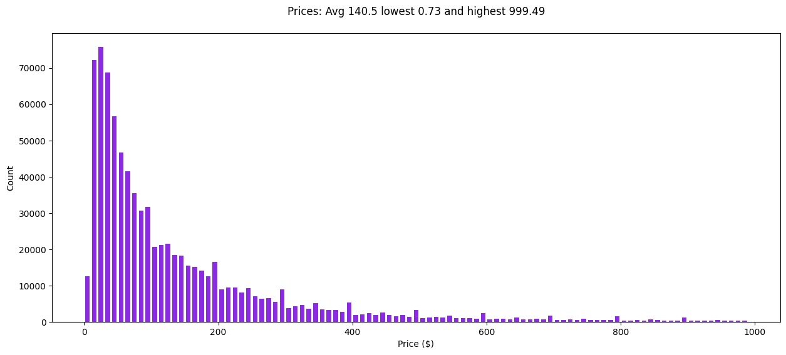

*Efter att ha rensat bort extrema outliers och dubbletter återstod ett välbalanserat dataset på 820 000 produkter fördelat över olika kategorier.*

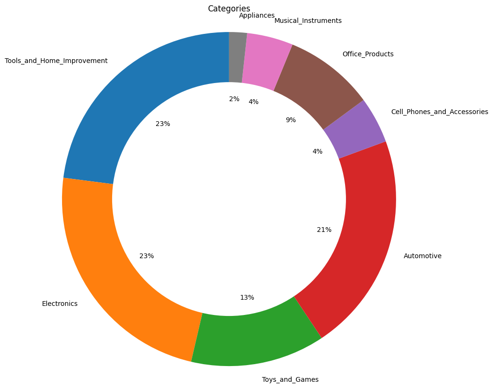

*Kategoriernas fördelning efter det viktade urvalet. Verktyg och hemförbättring, elektronik och fordonsprodukter utgör fortfarande de största grupperna, men urvalet ger också utrymme åt andra typer av produkter.*

### Kontextdesign: LLM-driven förädling

Amazon-beskrivningar är kända för att vara spretiga. Säljtext, HTML-taggar, tekniska specifikationer och tillverkarens skryt blandas i en enda röra.

Innan vi tränade en enda prismodell lät vi därför en liten och effektiv språkmodell (GPT-4.1 Nano) agera "digital redaktör". Genom en strikt instruktion tvingades den att koka ner varje kaotisk råtext till fem rena, strukturerade fält: **Title, Category, Brand, Description och Details**.

Det kallas för *kontextdesign*. Eftersom en språkmodell bygger sitt svar steg för steg och påverkas av allt som ligger i dess kontextfönster, blir kvaliteten på indatan helt avgörande. Genom att rensa bort allt brus och ge modellerna optimalt strukturerad information i förväg skapar vi de bästa förutsättningarna för att algoritmerna ska lyckas.

**Visa teknisk fördjupning: Så såg instruktionen till språkmodellen ut**

En kort systemprompt användes för att ge produktbeskrivningarna ett konsekvent format:

```python
SYSTEM_PROMPT = """Create a concise description of a product. Respond only in this format. Do not include part numbers.
Title: Rewritten short precise title
Category: eg Electronics
Brand: Brand name
Description: 1 sentence description
Details: 1 sentence on features"""
```

Ett konkret exempel från körningen:

```text
Title: Schlage F59 Interior Half Door Knob – Oil Rubbed Bronze
Category: Hardware
Brand: Schlage
Description: A solid bronze interior knob with deadbolt for easy, secure entry.
Details: Features oil-rubbed finish, 4" center-to-center clearance, and lifetime mechanical and finish warranty.

Input tokens: 446
Output tokens: 86
Cost: 0.006 cents
```

Fullständigt sammanhang: [Steg 2 – LLM-förädling](notebooks/steg2.html).

Poängen här är att hundratusentals spretiga produktposter kunde pressas in i exakt samma struktur innan de nådde prismodellerna. Det gjorde det mycket lättare för dem att lära sig.

---


## Rond 2: När modellen får tillgång till "orden" förbättras resultatet

Hur får man en matematisk regressionsformel att förstå skriven text? Vi testar den klassiska metoden **Bag-of-Words**.

Vi skapade en lista på de 2 000 vanligaste och mest betydelsebärande orden i våra nystädade produktbeskrivningar. Varje produkt översätts sedan till en lång vektor (en rad med 2 000 siffror) som helt enkelt anger hur ofta ord som *luxury*, *LED*, *leather*, *plastic* eller *Schlage* förekommer i texten.

- **Resultat (Bag-of-Words):** Felet rasar till **76,81 dollar**.

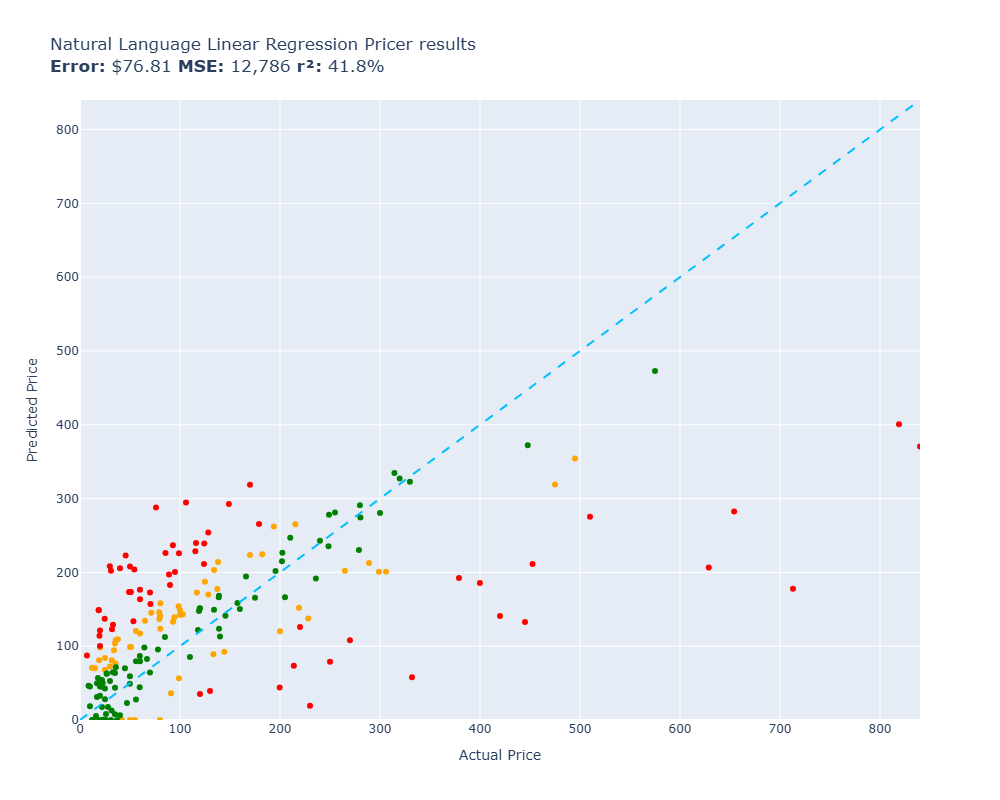

*Med Bag-of-Words som representation börjar gissningarna äntligen leta sig upp mot den perfekta diagonalen.*

Detta är ett otroligt ögonblick. En enkel, klassisk regressionsmodell som körs på en bråkdel av en sekund har precis **utklassat den mänskliga referenspunkten** (Eds $87,62) med nästan 11 dollar.

Varför räcker den här enkla metoden så långt? Därför att enskilda nyckelord i texten har en stark koppling till produktens värde. I det här fallet räknas antal förekomster av ord som *luxury*, *LED*, *leather*, *plastic.* 

Men metoden har en svaghet: den saknar helt sammanhang. Vår *Bag-of-Words*-metod är nämligen kontextoberoende. Ordet 'fil' får till exempel exakt samma representation oavsett om texten handlar om en *datorfil*, en *körfil på motorvägen* eller en skål med *frukostfil*. 

Modellerna i denna rond saknar (till skillnad från moderna språkmodeller) förmågan att låta orden färgas av varandra.

**Visa teknisk fördjupning: Så blir texten 2 000 siffror**

Själva omvandlingen är förvånansvärt kompakt i scikit-learn:

```python
np.random.seed(42)
vectorizer = CountVectorizer(max_features=2000, stop_words='english')
X = vectorizer.fit_transform(documents)
```

`CountVectorizer` bygger först ett ordförråd från träningsmaterialet. Varje produkt blir sedan en numerisk vektor där positionerna motsvarar ord i detta ordförråd. Modellen behöver alltså inte "läsa" text på mänskligt vis – den får ett stort antal mätbara ordsignaler att arbeta med.

Fullständigt sammanhang: [Steg 3 – klassisk maskininlärning](notebooks/steg3.html).

---


## Rond 3: Klassisk ML – Hur långt räcker de gamla trotjänarna?

För att se hur långt vi kan få ner felet utan att blanda in tunga neurala nätverk, testade vi mer komplexa "trädbaserade" modeller.

Först ut var en **Random Forest** (slumpmässig skog av beslutsträd), som tog oss ner till:

- **Resultat (Random Forest):** Ett snittfel på **72,28 dollar**.

Därefter testade vi den moderna varianten **XGBoost** (Gradient Boosting). Istället för att bara bygga oberoende beslutsträd, tränar XGBoost träden sekventiellt, där varje nytt träd specialiserar sig på att korrigera de misstag som de tidigare träden gjorde.

- **Resultat (XGBoost):** Felet pressas ner till **68,23 dollar**.

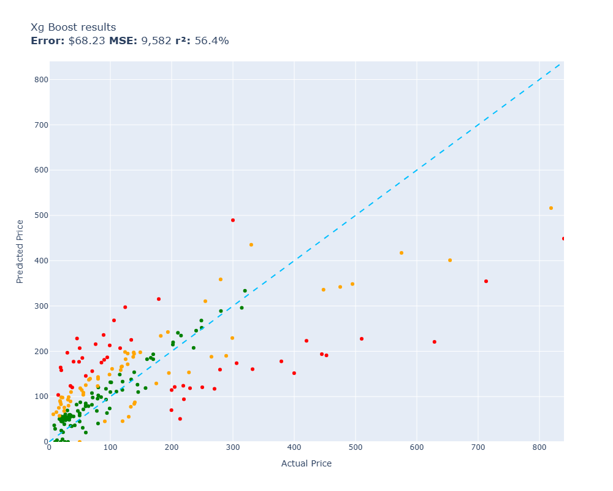

*XGBoost lyckas fånga komplexa, icke-linjära mönster i texten, även om de allra dyraste lyxprodukterna fortfarande är svåra att pricka helt rätt.*

I tider av generativ AI är det lätt att avfärda det här som "gammal teknik". Men här har en blixtsnabb och billig modell kapat det ursprungliga blinda felet med nästan 40 dollar. I en skarp produktionsmiljö drar den minimalt med resurser och har ett helt förutsägbart beteende.

**Visa teknisk fördjupning: Samma ordrepresentation, en annan modell**

`X` innehåller samma ordräkningar som användes för den textbaserade regressionen och `prices` innehåller de korrekta priserna. Här får XGBoost arbeta med den informationen:

```python
xgb_model = xgb.XGBRegressor(
    n_estimators=1000,
    random_state=42,
    n_jobs=4,
    learning_rate=0.1
)
xgb_model.fit(X, prices)
```

Modellen bygger träden stegvis och kan fånga kombinationer av ordsignaler som en linjär modell inte kan uttrycka på samma sätt. Här används 1 000 träd. Inlärningstakten på 0,1 styr hur stort bidrag varje nytt träd får göra, och `n_jobs=4` låter beräkningarna använda fyra trådar.

När modellen ska värdera en ny produkt används samma textomvandling som tidigare:

```python
def xg_boost(item):
    x = vectorizer.transform([item.summary])
    return max(0, xgb_model.predict(x)[0])
```

`transform` återanvänder det befintliga ordförrådet, så att orden hamnar på samma positioner som under träningen. `max(0, ...)` hindrar modellen från att lämna ett negativt pris.

Fullständigt sammanhang: [Steg 3 – klassisk maskininlärning](notebooks/steg3.html).

---


## Rond 4: Egna neurala nät mot färdigtränade språkmodeller

Nu kliver vi in i den moderna djupinlärningens era. Här ställde vi två helt olika paradigm mot varandra: gigantiska, generella språkmodeller mot egna, specialiserade neurala nätverk.

### De generella jättarna (Zero-shot)

Vi bad först världens ledande språkmodeller att gissa priset på produkterna utifrån beskrivningen – helt utan att de har fått träna på vårt dataset. De fick förlita sig helt på den allmänna kunskap om varumärken, material och marknadspositionering som de har byggt upp under sin gigantiska förträning (pre-training).

Resultaten imponerade stort:

- **GPT-4.1 Nano:** $62,51 i fel
- **Gemini 3 Pro:** $50,54 i fel
- **Claude 4.5 Sonnet:** $47,10 i fel
- **GPT-5.1:** $44,74 i fel

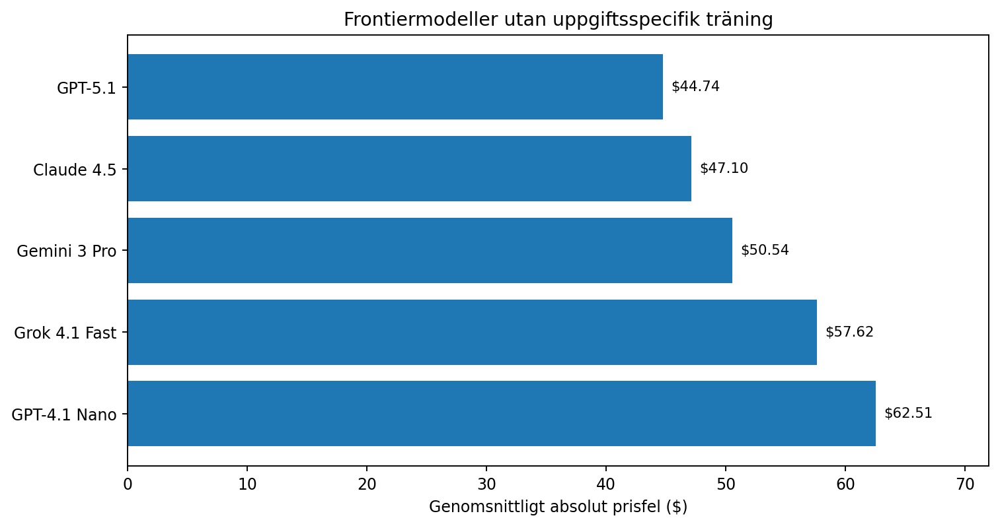

*De generella modellerna presterar fantastiskt bra enbart på sin breda förståelse av världen.*

**Visa teknisk fördjupning: Hur lite kod ett sådant zero-shot-test kräver**

Efter allt arbete med egna modeller är kontrasten slående. Produkten skickas med in i en enkel prompt:

```python
def messages_for(item):
    message = f"Estimate the price of this product. Respond with the price, no explanation\n\n{item.summary}"
    return [{"role": "user", "content": message}]
```

Och GPT-4.1 Nano anropas:

```python
# The function for gpt-4.1-nano

def gpt_4__1_nano(item):
    response = completion(model="openai/gpt-4.1-nano", messages=messages_for(item))
    return response.choices[0].message.content
```

Ingen träning på prisdatan görs i förväg. Modellen får bara produktbeskrivningen och ombeds ge ett pris direkt.

Fullständigt sammanhang: [Steg 4 – neurala nät och språkmodeller](notebooks/steg4.html).

### Utmanarna: Våra egna neurala nätverk

Som motvikt till de stora språkmodellerna byggde vi två egna neurala nätverk i PyTorch.

1. **Vårt första enkla nätverk (MLP):** Ett klassiskt åttalagers feed-forward-nätverk. Det tränades snabbt upp och landade på ett mycket respektabelt snittfel på **63,97 dollar**, vilket visade att nätverket framgångsrikt kunde lära sig icke-linjära samband i textrepresentationerna.
2. **Vårt djupa nätverk (Deep NN):** En betydligt kraftfullare modell utrustad med residualblock, LayerNorm och dropout. Med sina **289 miljoner parametrar** är vår modell en fortfarande en dvärg i jämförelse med giganter som GPT och Claude. Men den har en enorm fördel: den slipper kunna något annat. Den kan inte skriva dikter eller programmera – den kan bara värdera Amazon-produkter.

- **Resultat (Eget Deep NN):** Vårt skräddarsydda nätverk landade på ett snittfel på **46,49 dollar** vid träning på hela datasetet.

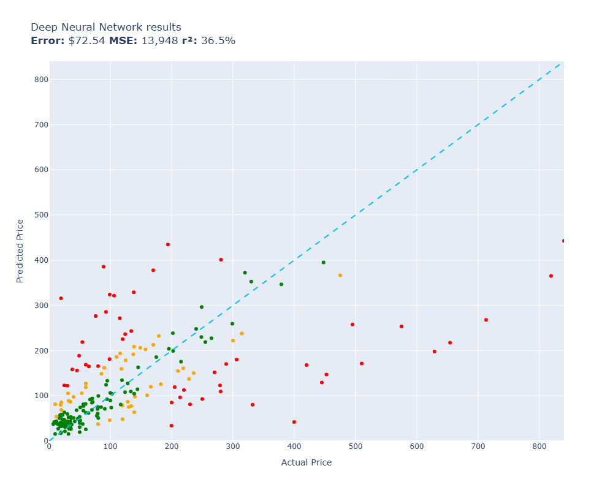

*Bilden ovan visar en provkörning på ett mindre Lite-dataset vilket gav ett högre fel ($72,54) än fullkörningen som används i huvudjämförelsen.*

Detta är ett otroligt resultat. En liten, specialtränad modell presterar i princip på samma nivå som världens mest avancerade och dyraste AI-modeller på denna specifika uppgift. Det är ett tydligt bevis på kraften i **domänspecifik specialisering**.

**Visa teknisk fördjupning: Det enkla MLP-nätverkets arkitektur och träningsloop**

Innan texten når nätverket omvandlas den till en numerisk representation med 5 000 dimensioner:

```python
vectorizer = HashingVectorizer(
    n_features=5000,
    stop_words='english',
    binary=True
)
X = vectorizer.fit_transform(documents)
```

`HashingVectorizer` använder en fast beräkningsregel för att placera orden i vektorn, i stället för att först bygga ett ordförråd. Med `binary=True` utgår representationen från om ord förekommer, snarare än hur många gånger de upprepas. Nätverket får alltså fortfarande siffror som representerar texten, inte själva orden.

Det mindre åttalagersnätet har **669 249 träningsbara parametrar** med denna indata. Det är dessa vikter och biasvärden som justeras under träningen. Nätet med 289 miljoner parametrar är den separata, djupare modellen som beskrivs ovan.

I labben definierades det mindre åttalagersnätet på följande vis i PyTorch:

```python
# Defining a 8 layer neural network

class NeuralNetwork(nn.Module):
    def __init__(self, input_size):
        super(NeuralNetwork, self).__init__()
        self.layer1 = nn.Linear(input_size, 128)
        self.layer2 = nn.Linear(128, 64)
        self.layer3 = nn.Linear(64, 64)
        self.layer4 = nn.Linear(64, 64)
        self.layer5 = nn.Linear(64, 64)
        self.layer6 = nn.Linear(64, 64)
        self.layer7 = nn.Linear(64, 64)
        self.layer8 = nn.Linear(64, 1)
        self.relu = nn.ReLU()

    def forward(self, x):
        output1 = self.relu(self.layer1(x))
        output2 = self.relu(self.layer2(output1))
        output3 = self.relu(self.layer3(output2))
        output4 = self.relu(self.layer4(output3))
        output5 = self.relu(self.layer5(output4))
        output6 = self.relu(self.layer6(output5))
        output7 = self.relu(self.layer7(output6))
        output8 = self.layer8(output7)
        return output8
```

Själva träningen av nätverket gjordes i en klassisk loop som upprepades batch för batch:

```python
loss_function = nn.MSELoss()
optimizer = optim.Adam(model.parameters(), lr=0.001)

EPOCHS = 2

for epoch in range(EPOCHS):
    model.train()
    for batch_X, batch_y in tqdm(train_loader):
        optimizer.zero_grad()

        # The 4 stages of training: forward pass, loss calculation, backward pass, optimize
        outputs = model(batch_X)
        loss = loss_function(outputs, batch_y)
        loss.backward()
        optimizer.step()

    model.eval()
    with torch.no_grad():
        val_outputs = model(X_val)
        val_loss = loss_function(val_outputs, y_val)

    print(f'Epoch [{epoch+1}/{EPOCHS}], Train Loss: {loss.item():.3f}, Val Loss: {val_loss.item():.3f}')
```

Modellen gör först en gissning, mäter felet mot facit, räknar bakåt hur nätets vikter bidrog till felet (backpropagation) och justerar dem därefter.

Fullständigt sammanhang: [Steg 4 – neurala nät och språkmodeller](notebooks/steg4.html).

---


## Rond 5: Den dyrköpta läxan om fine-tuning

Efter att ha sett hur bra GPT-4.1 Nano presterade i sitt grundutförande ($62,51) och hur bra vårt djupa neurala nätverk presterade tack vare specialträning ($46,49) kändes nästa steg givet: Vi gör en **fine-tuning** av GPT-4.1 Nano och låter den träna på vårt dataset för att skapa den ultimata prissättaren.

Men här stötte vi på ett lärorikt bakslag.

### Den perfekta modellen?

Under det första testet av den finjusterade modellen visade testresultatet ett genomsnittligt fel på exakt **0,00 dollar**. Hade vi byggt en perfekt AI?

Svaret är tyvärr nej. Vi hade drabbats av en *dataläcka*. Vid skapandet av testprompterna hade vi av misstag råkat behålla facit (priset) i indatan. Modellen hade inte blivit "synsk" – den läste bara innantill från provfrågan.

### Det verkliga resultatet

När felet korrigerades och modellen utvärderades ordentligt kom kallduschen:

- **GPT-4.1 Nano (Grundutförande):** $62,51 i fel
- **GPT-4.1 Nano (Fine-tuned):** $75,91 i fel

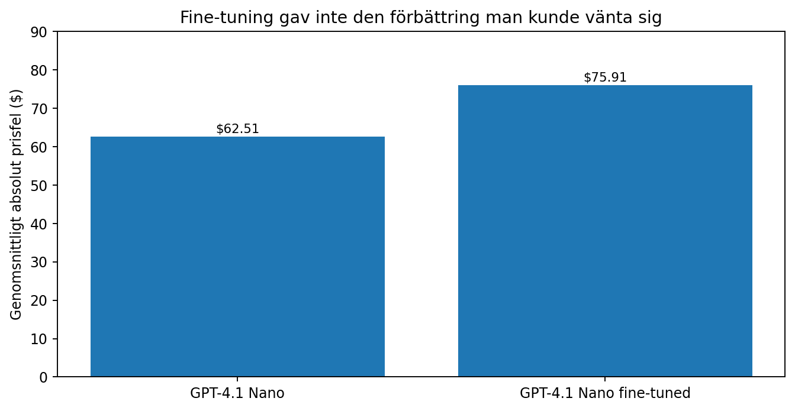

*Den finjusterade modellen presterade i slutändan betydligt sämre än vad den gjorde i sitt grundutförande.*

Hur kunde finjusteringen göra modellen sämre?

Detta är en välkänd risk inom AI-träning. När man finjusterar en modell på ett specifikt och ganska enformigt mönster riskerar man att förstöra dess välbalanserade och finstämda inre representationer. Modellen kan drabbas av **katastrofal glömska** (*catastrophic forgetting*) där den blir så extremt fokuserad på att imitera det stela formatet i vårt dataset att dess neurala nätverk överanpassas. Den tappar helt enkelt bort den breda, flexibla världsförståelse som den hade med sig från sin pre-training.

Slutsatsen blir därför: **börja alltid med att optimera din prompt och din kontext innan du väljer att ge dig på fine-tuning.**

**Visa teknisk fördjupning: Hur fine-tuning-jobbet konfigurerades**

Varje träningsexempel bestod här av en instruktionsprompt och det korrekta svar som modellen ska efterlikna:

```python
def messages_for(item):
    message = f"Estimate the price of this product. Respond with the price, no explanation\n\n{item.summary}"
    return [
        {"role": "user", "content": message},
        {"role": "assistant", "content": f"${item.price:.2f}"}
    ]
```

Detta konverterades till JSONL-filer (ett träningsexempel med hela meddelandelistan per rad) och laddades upp för att starta finjusteringen:

```python
openai.fine_tuning.jobs.create(
    training_file=train_file.id,
    validation_file=validation_file.id,
    model="gpt-4.1-nano-2025-04-14",
    seed=42,
    hyperparameters={"n_epochs": 1, "batch_size": 1},
    suffix="pricer"
)
```

Skillnaden mot zero-shot-testet är alltså att modellens grundläggande vikter justeras permanent under processen.

Fullständigt sammanhang: [Steg 5 – fine-tuning](notebooks/steg5.html).

---


## Så slutade tävlingen

Här är den samlade resultattavlan som visar hur de olika generationerna av maskininlärning presterade. Ju lägre siffra, desto bättre:

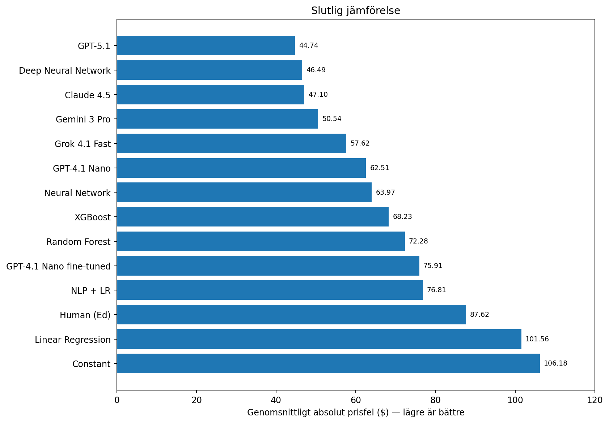

*Genomsnittligt absolut prisfel (MAE) i dollar för samtliga metoder – lägre är bättre. Deep NN avser fullkörningen (46,49 dollar), inte Lite-körningen ovan (72,54 dollar).*


| Modell / metod                      | Genomsnittligt fel (MAE) | Kommentar                                                 |
| ----------------------------------- | ------------------------ | --------------------------------------------------------- |
| **GPT-5.1**                         | **$44,74**               | **Bäst i test.** Extremt kapabel, men dyr i drift.        |
| **Djupt neuralt nätverk (Eget)**    | **$46,49**               | **Projektets stjärna.** Bevisar värdet av specialisering. |
| Claude 4.5 Sonnet                   | $47,10                   | Otroligt stark prestanda direkt "out of the box".         |
| Gemini 3 Pro                        | $50,54                   | Stabil och balanserad prestanda bland jättarna.           |
| Grok 4.1 Fast                       | $57,62                   | Snabb men ändå förvånansvärt träffsäker.                  |
| GPT-4.1 Nano                        | $62,51                   | Stark grundnivå för generella språkmodeller.              |
| Neuralt nätverk (Eget, 8 lager)     | $63,97                   | Imponerande bra för sin extremt lilla storlek.            |
| **XGBoost**                         | **$68,23**               | **Bästa klassiska ML.** Blixtsnabb, billig och stabil.    |
| Random Forest                       | $72,28                   | Bra, men slås tydligt av XGBoost.                         |
| GPT-4.1 Nano (Fine-tuned)           | $75,91                   | Avskräckande exempel på misslyckad finjustering.          |
| Linjär regression (Bag-of-Words)    | $76,81                   | Bevisar att rätt datarepresentation är halva segern.      |
| **Människa (Ed Donner)**            | **$87,62**               | **Utklassad av nästan alla algoritmer.**                  |
| Linjär regression (enkla variabler) | $101,56                  | Bevisar att dåliga ledtrådar ger dåliga resultat.         |
| **Blind gissning (Medelpris)**      | **$106,18**              | Projektets absoluta bottennivå.                           |


---


## Mina lärdomar från projektet


### 1. En glasklar utvärdering (eval) är nyckeln till framgång

I AI-projekt fastnar man lätt i subjektiva diskussioner om vilka svar som "känns bäst". Det unika med detta projekt är att vi hade ett hårt, mätbart facit. Att koka ner all komplexitet till en enda siffra gjorde att vi kunde arbeta helt systematiskt.

### 2. Grovjobbet sker i datan, inte i modellbygget

Att sammanställa, rensa och strukturera rådatan lade grunden för experimentet. Genom att filtrera bort outliers, rensa dubletter och använda en LLM för att städa upp Amazon-beskrivningarna gav vi de mindre modellerna förutsättningar att lära sig användbara mönster.

### 3. Klassisk maskininlärning är långt ifrån död

Att XGBoost når ett fel på 68,23 dollar för en bråkdel av driftkostnaden är en fantastisk prestation. I produktion är en sådan modell blixtsnabb, drar minimalt med serverresurser och har ett helt förutsägbart beteende.

### 4. Specialisering kan kompensera för storlek

Resultatjämförelsen visar hur långt ett specialiserat nätverk kan nå på en tydligt avgränsad uppgift. En modell som bara behöver lösa ett problem kan lägga hela sin kapacitet på just det. Det gör egna modeller till ett intressant alternativ när det finns tillräckligt med relevant träningsdata och ett värde i att kunna styra driften själv.

### 5. Fine-tuning måste bevisa sitt värde

Ytterligare träning är ingen garanti för bättre resultat. Även en finjusterad modell måste jämföras med grundmodellen på exempel som hållits utanför träningen. Lärdomen är att varje steg mot en mer komplex lösning behöver motiveras av en uppmätt förbättring.

---


## Vad resan säger om AI:s utveckling hittills

Resan genom maskininlärningens utveckling gav mig en mer nyanserad bild av vad framsteg inom AI innebär. Varje ny metod öppnar möjligheter, men hur mycket den tillför beror på uppgiften, informationen den får och arbetet bakom träningen. De stora språkmodellerna har en påtaglig styrka i att kunna ta sig an nya problem direkt. Samtidigt finns mycket kraft i äldre metoder och i modeller som tränats för ett enda, avgränsat ändamål.

Det jag tar med mig är därför ett lämpligt arbetssätt: börja med att förstå problemet, ge modellen användbar information och låt en tydlig utvärdering visa vad nästa steg faktiskt tillför. Då blir modellvalet ett konkret ingenjörsbeslut där träffsäkerhet vägs mot kostnad, tid och kontroll. Efter den här experimentet genom flera generationer av AI är det just det som jag fått bättre förståelse kring — att kunna bedömma när en enkel lösning räcker och när mer avancerad teknik gör verklig skillnad.

---


## Kod och originalnotebooks

De fullständiga notebook-exporterna finns kvar som referens. Länkarna nedan utgår från projektets `notebooks/`-mapp. HTML-filerna kan laddas ner och öppnas i en webbläsare för att visa den renderade notebooken.

- [Steg 1 – dataurval och tvätt](notebooks/steg1.html)
- [Steg 2 – LLM-förädling](notebooks/steg2.html)
- [Steg 3 – klassisk maskininlärning](notebooks/steg3.html)
- [Steg 4 – neurala nät och språkmodeller](notebooks/steg4.html)
- [Steg 5 – fine-tuning](notebooks/steg5.html)
- [Extra – djupt neuralt nätverk](notebooks/deep_neural_network_extra.html)
- [Samlad resultatnotebook](notebooks/resultat.html)

